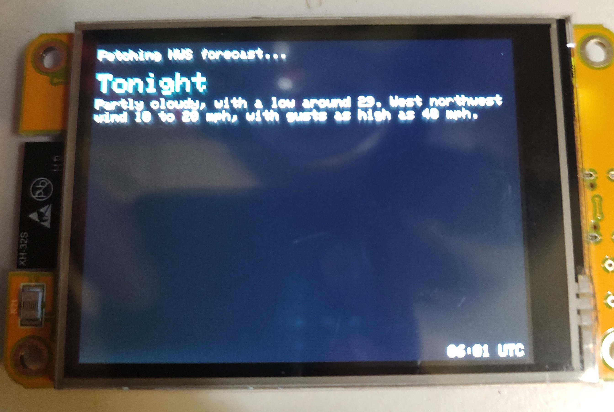
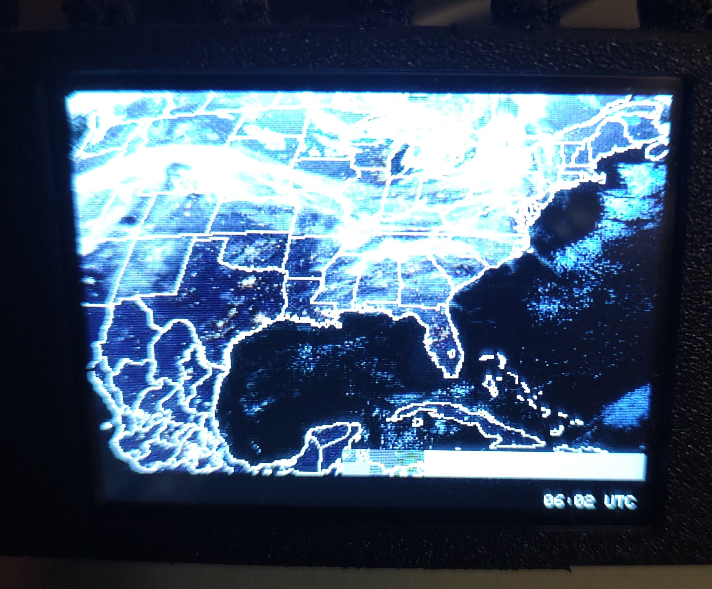

# WeatherCore — NOAA GOES Satellite Image + NWS Forecast for CYD

A live NOAA GOES satellite image viewer and NWS text forecast display running on the **CYD (Cheap Yellow Display)** ESP32 board. Fetches and displays a fresh satellite image every 5 minutes and a local NWS forecast every 30 minutes — no API key required.

| NWS Forecast | GOES Satellite (nighttime) |
|:---:|:---:|
|  |  |

---

## What it does

- Connects to your WiFi network on boot
- Fetches the latest **NOAA GOES GeoColor** satellite image from `cdn.star.nesdis.noaa.gov`
- Decodes the JPEG in memory and renders it to the ILI9341 display
- Refreshes every **5 minutes** (NOAA updates the image at that frequency)
- Displays the **NWS text forecast** and **NWS active alerts** for your location
- Press the **BOOT button** at runtime to cycle through all satellite views and NWS modes
- Shows on-screen status messages throughout (WiFi connecting, fetching, decoding)

---

## Hardware

| Component | Details |
|---|---|
| Board | ESP32 (CYD — ESP32-2432S028R or compatible) |
| Display | ILI9341 TFT, 320×240, hardware SPI |
| Backlight | GPIO 21 |
| Display SPI | DC=2, CS=15, SCK=14, MOSI=13, MISO=12 |

---

## Project Structure

```
WeatherCore/
├── platformio.ini
├── src/
│   └── main.cpp           — WiFi, portal init, fetch loop, JPEG decode, display
├── include/
│   ├── Portal.h           — Captive portal: AP setup, web UI, NVS settings persistence
│   ├── NWSForecast.h      — NWS API fetch, JSON parse, forecast + alerts display
│   ├── HTTPS.h            — WiFiClientSecure HTTPS GET with chunked transfer support
│   └── JPEG.h             — JPEGDEC instance
│
│   ── Inverted display variant (see below) ──
├── INVERTEDsrc/
│   └── main.cpp           — Same as above with invertDisplay(true)
├── INVERTEDinclude/
│   ├── Portal.h
│   ├── NWSForecast.h      — Colors adjusted for white-background inverted display
│   ├── HTTPS.h
│   └── JPEG.h
└── INVERTEDplatformio/
    └── platformio.ini
```

---

## Setup

1. **Clone or download** this project and open it in VS Code with PlatformIO installed.

2. **Build and upload:**
   ```
   pio run --target upload
   ```

3. **On first boot the device enters setup mode:**
   - The display shows step-by-step instructions
   - An open WiFi access point called **`WeatherCore_Setup`** is created
   - Connect your phone or PC to that network, then open **`192.168.4.1`** in your browser
   - Enter your WiFi credentials, choose a NOAA satellite view, and optionally enter your **latitude and longitude** for NWS forecast and alerts
   - Tap **Save & Connect**
   - The portal closes, the device connects to your WiFi, and the satellite image appears

4. **On subsequent boots** the device skips the portal and connects automatically using saved settings.  
   To change your WiFi or settings, **hold the BOOT button** during the first 3 seconds after power-on — the setup portal will reopen.

5. **To switch modes at runtime**, press the **BOOT button** briefly to cycle through all 10 modes. The selected mode is saved to flash.

> ⚠️ ESP32 only supports **2.4 GHz** WiFi networks.

> 💾 WiFi credentials and mode selection are saved to flash (NVS) and survive power cycles.

---

## Inverted Display Variant

Some CYD boards ship with an inverted display — everything appears with a **white background and dark text/colors** instead of black. If your screen looks inverted, use the files from the `INVERTED*` folders instead:

1. Replace the contents of `src/` with the files from `INVERTEDsrc/`
2. Replace the contents of `include/` with the files from `INVERTEDinclude/`
3. Replace `platformio.ini` with the one from `INVERTEDplatformio/`
4. Build and upload as normal

The inverted variant is identical in functionality — all 10 modes work the same way. Colors are adjusted so the display looks correct on white-background hardware.

---

## Modes

Press the **BOOT button** briefly at runtime to cycle through all modes. Mode is saved to flash.

| # | Mode | Refresh |
|---|---|---|
| 0 | GOES-East CONUS *(default)* | 5 min |
| 1 | GOES-West CONUS | 5 min |
| 2 | Eastern US | 5 min |
| 3 | Gulf of Mexico | 5 min |
| 4 | Caribbean | 5 min |
| 5 | Alaska | 5 min |
| 6 | Full Earth Disk | 5 min |
| 7 | Mesoscale (hi-refresh) | 5 min |
| 8 | NWS Forecast (Text) | 30 min |
| 9 | NWS Alerts | 5 min |

**NWS modes require a US location.** Enter your latitude and longitude in the setup portal (e.g. `38.71`, `-105.14`). No API key required — powered by [api.weather.gov](https://www.weather.gov/documentation/services-web-api).

NWS Alerts shows active warnings and watches for your area, or a green "No active alerts" confirmation when the area is clear.

To reconfigure WiFi or coordinates, reboot and hold BOOT within 3 seconds to reopen the portal.

---

## Dependencies

Managed automatically by PlatformIO:

| Library | Author | Purpose |
|---|---|---|
| [GFX Library for Arduino](https://github.com/moononournation/Arduino_GFX) @ 1.4.7 | moononournation | ILI9341 display driver |
| [JPEGDEC](https://github.com/bitbank2/JPEGDEC) | bitbank2 | In-memory JPEG decoding |
| [ArduinoJson](https://arduinojson.org/) | bblanchon | NWS API JSON parsing |
| [XPT2046_Touchscreen](https://github.com/PaulStoffregen/XPT2046_Touchscreen) | paulstoffregen | CYD touch (included for compatibility) |

---

## Credits & Acknowledgements

### [WeatherPanel](https://github.com/moononournation/WeatherPanel) by moononournation
The original **WeatherSatelliteImage** Arduino sketch that inspired this project. It targets a different ESP32 board (AXS15231B QSPI 172×640 display) and fetches FY-4B satellite imagery from China's NMC weather service. The core HTTPS fetch logic (`HTTPS.h`) and JPEG decode callback pattern come directly from this project.

> Original designed for the FengYun FY-4B geostationary satellite over Asia. Adapted here for NOAA GOES and the CYD hardware platform.

---

## Conversion Notes

Key changes made when porting WeatherSatelliteImage → WeatherCore:

| Original | WeatherCore |
|---|---|
| AXS15231B QSPI 172×640 display | ILI9341 HWSPI 320×240 (CYD) |
| `Arduino_Canvas` wrapper | Direct rendering |
| `NetworkClientSecure` (Arduino ESP32 3.x) | `WiFiClientSecure` (Arduino ESP32 2.x) |
| FY-4B NMC image server (Asia-only) | NOAA GOES CDN (worldwide) |
| Timestamped URL construction | Static "latest image" URL |
| NTP required for URL building | NTP not needed |

---

## License

This project builds on open-source work. Please respect the licenses of the upstream projects listed above.

